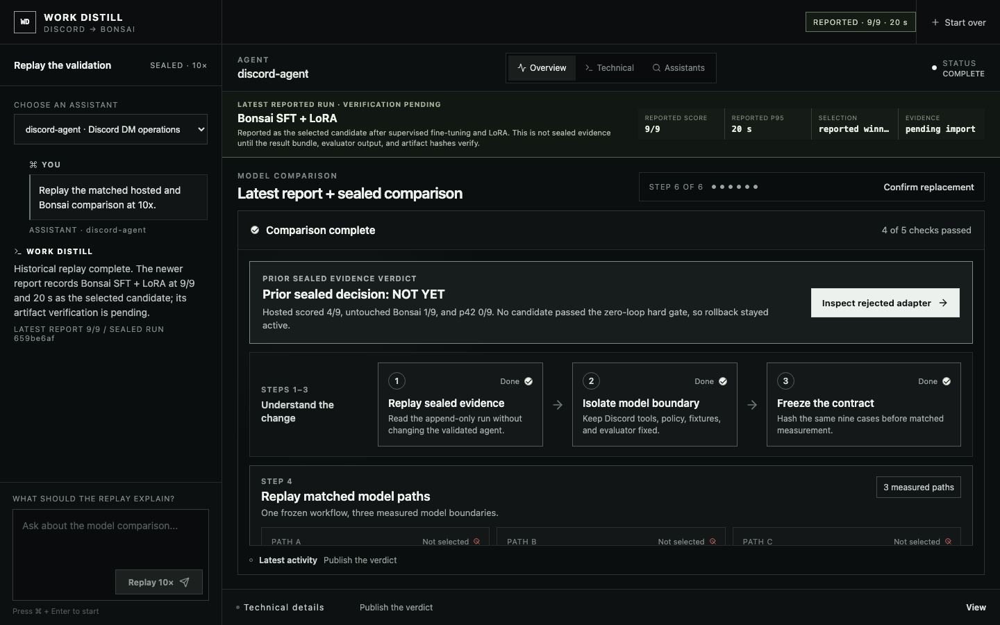
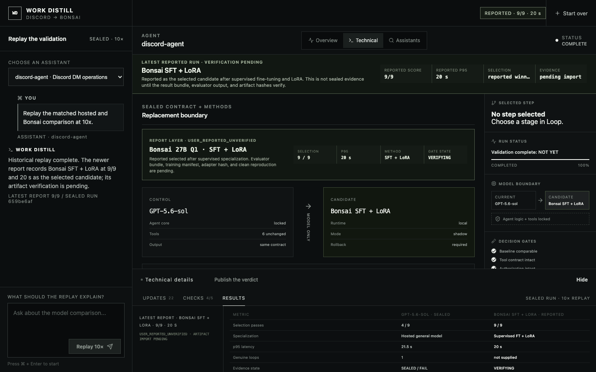

# Work Distill

[](https://github.com/shreyvish5678/klin/actions/workflows/ci.yml)

Work Distill is an evidence-first interface for deciding whether an agent's
hosted model can be replaced by a cheaper local model without changing the
agent around it.

## Latest reported candidate

| Candidate | Method | Reported result | Reported p95 | Status |
| --- | --- | ---: | ---: | --- |
| Bonsai 27B Q1 | Supervised fine-tuning + LoRA | **9/9** | **20 s** | Reported selected winner; verification pending |

This is the latest user-reported improvement. The scored bundle, evaluator
output, model/adapter hashes, and clean-reproduction record are not present in
the repository yet, so it is not represented as sealed proof. The earlier
sealed run remains available as historical evidence.

The production demo is in [`products/dist-ui`](products/dist-ui). It contains
the responsive React product, local SSE orchestrator, sanitized sealed replay,
real-browser tests, architecture handoff, screenshots, and a YouTube-ready
screen recording.





## Start the product

```sh
cd products/dist-ui
npm install
npm run dev
```

Open [http://127.0.0.1:5173](http://127.0.0.1:5173) and select
**Replay at 10×**.

## Validate

```sh
cd products/dist-ui
npm run validate
```

The validation gate runs six deterministic and browser-level tests, including
the 390 px responsive surface, then creates the production Vite build.

## Demo and documentation

- [Final report](FINAL-REPORT.md)
- [Developer kit](developer-kit/README.md)
- [12-second H.264 product demo](products/dist-ui/public/work-distill-demo.mp4)
- [Technical screenshot](products/dist-ui/public/demo-technical.png)
- [System design](products/dist-ui/docs/SYSTEM-DESIGN.md)
- [Implementation prompt](products/dist-ui/docs/IMPLEMENTATION-PROMPT.md)
- [Result import contract](products/dist-ui/docs/RESULT-IMPORT.schema.json)
- [Presenter script](products/dist-ui/docs/DEMO-SCRIPT.md)

The historical replay is sanitized sealed evidence. The newer 9/9 result is a
separate user-reported layer pending verification. No production Discord write
or secret is included.

`workflowdistill-replay-site` is the earlier presentation prototype;
`products/dist-ui` is the maintained product surface.
