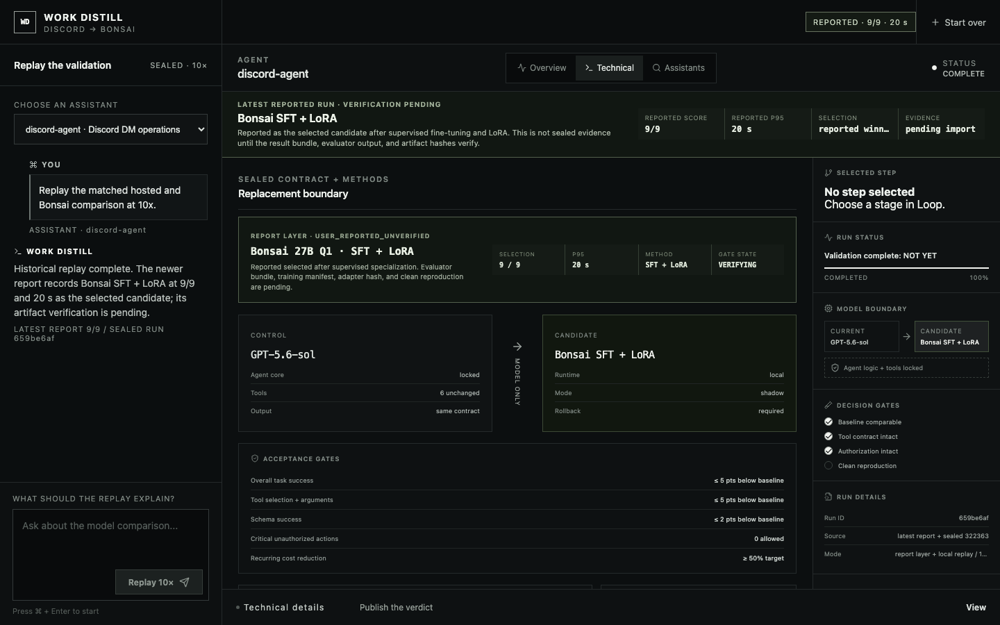

# Work Distill UI

Work Distill is a local evidence surface for deciding whether an agent's
hosted model can be replaced by a cheaper, private model without changing the
agent around it. This build replays a sanitized, sealed Discord-to-Bonsai
validation at 10× through the existing React interface and an Express/SSE
orchestrator.

## Latest reported result

The UI now carries the user's newer report:

| Candidate | Method | Reported score | Reported p95 | Classification |
| --- | --- | ---: | ---: | --- |
| Bonsai 27B Q1 | Supervised fine-tuning + LoRA | 9/9 | 20 s | User-reported, verification pending |

This report is prominent in the product but is not relabeled as sealed
evidence. Promotion to measured status requires the result bundle, evaluator
output, artifact hashes, and clean-reproduction record defined by
`docs/RESULT-IMPORT.schema.json`.

[Watch the 12-second product demo](public/work-distill-demo.mp4)


The Overview explains the decision in plain language. The Technical tab
exposes the immutable execution DAG, exact aggregates, acceptance gates,
representative test cases, proposed next-method queue, and model-neutral
harness pseudocode.

## Run locally

Requires Node.js 20 or newer.

```sh
npm install
npm run dev
```

Open [http://127.0.0.1:5173](http://127.0.0.1:5173), then choose
**Replay at 10×**. No cloud deployment or Discord write is required.

## What is functional

- Creates an isolated replay run through `POST /api/runs`.
- Streams 22 ordered, sanitized events over server-sent events.
- Reconstructs three matched model paths in the same frozen agent workflow.
- Shows five visible Discord test cases and their per-model outcomes.
- Separates measured evidence from inference and unrun methods.
- Preserves rollback when quality, safety, or reproduction gates miss.
- Supports keyboard operation and a tested 390 px narrow viewport.
- Generates screenshots and a YouTube-ready H.264 demo from the real UI.

## Prior sealed result

| Model path | Passed | p95 latency | Genuine loops |
| --- | ---: | ---: | ---: |
| GPT-5.6-sol hosted control | 4/9 | 21.5 s | 1 |
| Untouched Bonsai 27B Q1 | 1/9 | 63.8 s | 3 |
| Bonsai + p42 LoRA | 0/9 | 144.7 s | 31 |

The prior sealed replacement verdict is **NOT YET** and production Discord
writes remain zero. In that historical run, proposed SFT, DPO, LoRA
rank-sweep, and grammar-decoding methods were `NOT RUN`. The newer 9/9 report
is displayed separately until its artifacts verify.




## Validate and capture

```sh
npm run validate
npm run capture:demo
```

`npm run validate` runs the deterministic event tests, real Chrome interaction
test, narrow-layout checks, and production build. `capture:demo` expects the
local server at `127.0.0.1:5173` and writes:

- `public/demo-overview.png`
- `public/demo-results.png`
- `public/demo-technical.png`
- `public/demo-reported-metrics.png`
- `public/work-distill-demo.mp4`

## Architecture and handoff

- [System design](docs/SYSTEM-DESIGN.md)
- [Implementation prompt](docs/IMPLEMENTATION-PROMPT.md)
- [Result import schema](docs/RESULT-IMPORT.schema.json)
- [60-second presenter script](docs/DEMO-SCRIPT.md)
- [Session handoff](SESSION-HANDOFF.md)

The source run remains immutable. A future result is rendered as measured only
after its sanitized bundle, case count, hard gates, and provenance hashes pass
the import contract.

## Project map

```text
src/                    React product surface
server.mjs              local HTTP and SSE orchestrator
server/workflow.mjs     sanitized replay contract and aggregates
tests/                  deterministic and real-browser checks
scripts/capture-demo.mjs repeatable product capture
docs/                   architecture, prompt, schema, and demo script
public/                 generated product media
```
